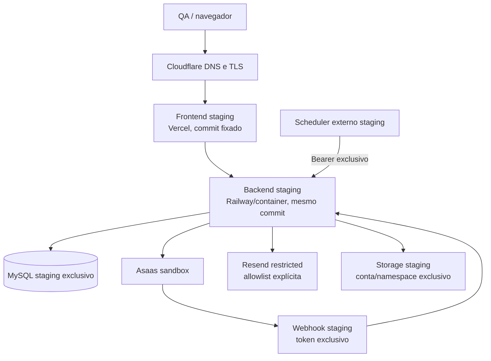

# Staging isolado e homologação integrada — 2026-08-28

## Resumo executivo

O projeto está preparado localmente para receber um staging isolado e falha fechado diante de configurações incompatíveis. Não houve deploy, login, checkout, webhook, cron, migration ou escrita em produção.

O staging remoto ainda não existe: em 2026-08-28, `staging.l4ckos.com.br` e `api-staging.l4ckos.com.br` não resolviam, e não foram fornecidos projetos remotos nem credenciais exclusivas. Portanto, a homologação integrada real com Asaas sandbox, Resend, storage, DNS, scheduler e browser permanece pendente.

## 1. Arquitetura de staging

Arquitetura proposta, sem redundância desnecessária:

- `staging.l4ckos.com.br`: frontend Vite em projeto/deployment Vercel separado de produção;
- `api-staging.l4ckos.com.br`: backend Express/tRPC em serviço Railway separado;
- MySQL staging separado por instância/database, usuário e credencial;
- Cloudflare apenas como DNS/TLS/proxy dos dois subdomínios;
- scheduler externo único chamando endpoints protegidos; timers internos desligados;
- mesmo SHA e imagens imutáveis para frontend/backend candidato.

### Auditoria da produção atual

| Componente | Produção atual observada | Staging necessário |
|---|---|---|
| Frontend | Vite SPA; configuração Vercel; `l4ckos.com.br` responde via Cloudflare/Vercel | projeto/deployment separado em `staging.l4ckos.com.br` |
| Backend | Express/tRPC em container; `api.l4ckos.com.br` aponta via Cloudflare para Railway, mas `/health` público retornou 404 no probe | serviço Railway separado em `api-staging...`, com `/health`, `/version`, `/ready` novos |
| Código | GitHub `bezerrayan/l4ckos-`; worktree candidato ainda não versionado | commit/tag de release e artefatos construídos uma vez |
| Banco | MySQL remoto configurado pelo backend; valores não exibidos | MySQL, database, usuário e senha exclusivos |
| Cloudflare/DNS | proxy/TLS na frente dos domínios principais | dois registros novos, sem alterar registros principais |
| Asaas | integração API, checkout e webhook existentes | conta/chave sandbox, URLs sandbox e token de webhook próprio |
| Resend | serviço de envio existente | chave/from controlados e allowlist explícita |
| Storage | proxy `BUILT_IN_FORGE_*` e fallback local legado | conta/endpoint/namespace exclusivo; local efêmero só por opt-in |
| Jobs | reservations, notifications e reconciliation; suporte a timers e endpoint | scheduler externo único, endpoints protegidos, timers internos off |
| CORS | política backend e configuração por env | allowlist exata apenas do frontend staging |
| Cookies | sessão JWT por cookie | nome exclusivo, host-only, Secure, HttpOnly, SameSite=Lax, Path=/ |
| OAuth | Google callback configurável | cliente Google próprio, `GOOGLE_OAUTH_ENV=staging`, callback na API staging |

Nenhum secret foi incluído nesta auditoria.

## 2. Recursos necessários

1. Projeto/deployment Vercel de staging.
2. Serviço Railway/backend de staging.
3. MySQL staging separado e usuário restrito.
4. Registros Cloudflare `staging` e `api-staging`, com TLS.
5. Conta e API key Asaas sandbox.
6. Token e cadastro de webhook sandbox.
7. Chave/configuração Resend de staging e destinatários QA.
8. Storage remoto/conta e namespace exclusivos, ou volume local efêmero explicitamente aceito.
9. Cliente Google OAuth de staging, se OAuth for homologado.
10. Scheduler externo de staging e secret exclusivo.
11. Secret manager, retenção de backup persistente e coleta/alerta de logs.

## 3. Variáveis, sem valores

A lista operacional completa e comentada está em `staging.env.example`. Grupos e variáveis críticas:

- Aplicação: `NODE_ENV`, `APP_ENV`, `RELEASE_VERSION`, `GIT_COMMIT_SHA`, `DEPLOYED_AT`, `APP_ID`, `VITE_APP_ENV`, `VITE_APP_ID`, `HOST`, `PORT`.
- Banco: `DATABASE_URL`, `EXPECTED_DATABASE_HOST`, `EXPECTED_DATABASE_NAME`, `PRODUCTION_DATABASE_HOST`, `PRODUCTION_DATABASE_NAME`.
- Auth: `JWT_SECRET`, `SESSION_SECRET_ENV`, `SESSION_COOKIE_NAME`, `PRODUCTION_SESSION_COOKIE_NAME`, `SESSION_COOKIE_DOMAIN`, `COOKIE_SECURE`, `COOKIE_SAME_SITE`, contas controladas, allowlists locais, `GOOGLE_CLIENT_ID`, `GOOGLE_CLIENT_SECRET`, `GOOGLE_OAUTH_ENV`, `GOOGLE_REDIRECT_URI`.
- Frontend/CORS: `FRONTEND_URL`, `APP_URL`, `APP_BASE_URL`, `API_PUBLIC_URL`, `VITE_API_URL`, origens esperadas/proibidas e `CORS_ORIGINS`.
- Asaas: `ASAAS_API_URL`, `ASAAS_CHECKOUT_BASE_URL`, `ASAAS_API_KEY`, `ASAAS_WEBHOOK_TOKEN`, `ASAAS_WEBHOOK_ENV`.
- Resend: `EMAIL_MODE`, `EMAIL_ENV`, `RESEND_API_KEY`, `STAGING_EMAIL_ALLOWLIST`, remetentes, replies, destinos internos, alertas e assinatura.
- Storage: `STORAGE_MODE`, `STORAGE_ENV`, `STORAGE_NAMESPACE`, `PRODUCTION_STORAGE_NAMESPACE`, `BUILT_IN_FORGE_API_URL`, `BUILT_IN_FORGE_API_KEY`, `ALLOW_EPHEMERAL_STAGING_STORAGE`.
- Frete: `MELHOR_ENVIO_API_URL`, `MELHOR_ENVIO_TOKEN`, `MELHOR_ENVIO_ENV`, CEP de origem e prefixos locais.
- Jobs/backup: `OPERATIONAL_JOBS_ENABLED`, `JOB_SCHEDULER_MODE`, `JOB_ENDPOINTS_ENABLED`, `CRON_SECRET`, `CRON_SECRET_ENV`, intervalos, `AUTOMATIC_BACKUPS_ENABLED`, `BACKUP_DIR`.
- Observabilidade/segurança: `LOG_LEVEL`, `OTEL_*`, limites de rate limit e flags operacionais.

## 4. Proteções implementadas

- `APP_ENV=local|test|staging|production` centralizado e obrigatório em deploy.
- Startup encerra com código não zero se identidade, banco, origens, Asaas, webhook, cron, storage, sessão, e-mail, jobs ou metadados forem incompatíveis.
- Validação simétrica: staging rejeita produção e produção rejeita sandbox conhecido.
- Banco validado por host/nome esperado e por host/nome proibido.
- Asaas staging exige hosts sandbox e prefixo de chave de homologação; produção rejeita chave sandbox.
- Webhook, cron, sessão, e-mail, storage e Melhor Envio exigem marcador de ambiente.
- Google OAuth configurado exige ID+secret juntos, marcador de ambiente e callback exato.
- Storage remoto não faz fallback silencioso para disco em staging.
- CORS usa comparação exata de origem e responde 403 à origem proibida.
- Cookie é host-only e tem nome diferente de produção.
- Logs estruturados incluem ambiente/build e redigem secrets, credenciais e PII sensível.
- O teste local provou inclusive que uma configuração herdada de Melhor Envio é recusada no startup.

## 5. Banco

Foi criado e validado localmente um banco sintético `l4ckos_staging_integrated_test_20260828`:

- migrations `0000` a `0015`: 16 arquivos, 62 statements, zero warning;
- schema: 23 tabelas, 56 índices esperados, 7 FKs, 10 checks, zero blocker;
- seed: dois usuários controlados, quatro produtos, quatro variantes, cinco imagens, estoque alto/1/0, cupom `STAGING10`, endereço e banner;
- nenhum dado pessoal de produção foi copiado.

`scripts/provision-staging-db.mjs` recusa ambiente diferente de staging, alvo de aparência produtiva e banco não vazio. `scripts/seed-staging.mjs` aceita senhas somente por env, exige contas `@example.test` e nunca imprime senhas.

O gate para banco já existente (`scripts/staging-migration-gate.mjs`) exige manutenção, checkout/jobs desligados e executa preflight → dump SQL → migration → drift → readiness, parando em `NO-GO` na primeira falha/warning.

## 6. Frontend

- `VITE_APP_ENV=staging` e `VITE_API_URL` são parâmetros explícitos do build.
- O cliente recusa combinação staging→API de produção e não cai silenciosamente para produção.
- Checkout consulta a configuração operacional, mostra indisponibilidade e desabilita a ação; o backend continua sendo a proteção principal.
- URLs de aplicativo/e-mail vêm das URLs staging.
- Imagem Docker recebe ambiente, API, versão e SHA no build.

Pendente remoto: construir e inspecionar o bundle real, publicar no Vercel staging e validar redirects/imagens/browser.

## 7. Backend

- Imagem Docker carrega versão, SHA e data como metadados/labels.
- `/health` e `/version` identificam ambiente/build; `/ready` valida processo, banco, schema e configuração.
- As dependências externas são descritas como configuração/degradação, sem derrubar um backend cujo banco/schema estejam saudáveis.
- Rate limits permanecem ativos e são ajustáveis dentro de testes controlados.
- Request IDs e logs estruturados permitem correlacionar chamadas.

## 8. Asaas

Pronto:

- suporte explícito a `https://api-sandbox.asaas.com/v3` e checkout `https://sandbox.asaas.com`;
- recusa de URL/key do ambiente errado;
- webhook staging com token exclusivo e 401 sem token;
- checkout desligado por padrão e bloqueado no backend.

Falta: conta/key sandbox real, registrar webhook público, executar cobrança controlada autorizada e provar reenvio/idempotência. Nenhuma chamada Asaas foi feita no smoke local.

## 9. Resend

- `EMAIL_MODE=restricted` é obrigatório no staging.
- Somente endereços de `STAGING_EMAIL_ALLOWLIST` podem receber.
- Destinatário bloqueado não é substituído: o envio é omitido, o bloqueio é logado e pedido/pagamento não quebram.
- Todos os assuntos recebem `[STAGING]` e os links usam a URL do staging.

Falta: chave/remetente controlado, domínio validado se necessário e envio real para uma conta allowlisted.

## 10. Jobs

Modelo escolhido: scheduler externo chama endpoints protegidos. `JOB_SCHEDULER_MODE=external`, `JOB_ENDPOINTS_ENABLED=true` e `OPERATIONAL_JOBS_ENABLED=true`; o scheduler interno não inicia. Reservations, notifications e reconciliation mantêm leases/idempotência P1.

Teste HTTP local: sem token 401, token incorreto 401, token correto 200. Falta configurar as três agendas no provedor remoto e observar execuções reais.

## 11. Checkout flag

- `CHECKOUT_ENABLED=false`: catálogo continua acessível, frontend informa indisponibilidade e backend recusa a criação de cobrança.
- `CHECKOUT_ENABLED=true`: libera somente quando maintenance está off.
- A proteção cobre a mutation transacional principal e o controller legado de criação Asaas.

## 12. Maintenance mode

`MAINTENANCE_MODE=true` bloqueia checkout, uploads/escritas administrativas destrutivas e jobs, preservando leituras seguras. O gate de migration exige manutenção ativa e checkout/jobs inativos.

## 13. Smoke tests

Smoke compilado contra backend + MySQL locais isolados: **GO, 14/14**.

| Verificação | Resultado |
|---|---|
| health/version/readiness | 200/200/200, ambiente e build coerentes |
| catálogo/variantes | 4 produtos/4 variantes |
| login cliente/admin | PASS com contas sintéticas |
| cron sem/errado/correto | 401/401/200 |
| webhook sem token | 401 |
| CORS staging | 204 |
| produção → staging | bloqueado com 403 |
| checkout controlado | bloqueado no backend; nenhuma cobrança externa |

Logs mostraram `environment`, versão, commit, requestId e e-mail/IP mascarados.

## 14. Regressão

| Gate local | Resultado final |
|---|---|
| P0 MySQL | 31/31 PASS |
| P1 MySQL | 33/33 PASS |
| Máquina de estados | 6/6 PASS |
| Segurança de ambiente | 9/9 PASS |
| Isolamento HTTP/cookie/jobs | 5/5 PASS |
| Segurança de e-mail | 2/2 PASS |
| Logout | 1/1 PASS |
| Typecheck cliente/servidor | PASS/PASS |
| Build cliente/servidor | PASS/PASS |
| Fresh install `0000→0015` | GO, 62 statements, 0 warnings |
| Drift banco staging local | 0 blockers |
| Backup/restore essencial | PASS; restore em segunda base, drift 0, fixtures conferidas |

## 15. Recursos externos ainda necessários

Bloqueadores da homologação remota:

- projetos Vercel/Railway staging e acesso de deploy;
- MySQL staging e credencial exclusiva;
- DNS/TLS para os dois subdomínios;
- conta/key Asaas sandbox e token/cadastro do webhook;
- Resend staging, remetente e allowlist reais de QA;
- storage exclusivo e namespace;
- cliente Google OAuth staging, se usado;
- scheduler externo e `CRON_SECRET` exclusivo;
- secret manager, volume/objeto persistente para backups e observabilidade/alertas.

## 16. Próximo passo exato

1. Criar os recursos acima sem copiar secrets de produção.
2. Versionar este candidato e registrar SHA/tag.
3. Preencher o secret manager a partir de `staging.env.example`, com checkout fechado.
4. Provisionar o MySQL com `pnpm staging:provision-db` e exigir `GO`.
5. Construir frontend/backend do mesmo SHA e implantar apenas nos projetos staging.
6. Criar DNS, validar TLS, health/version/readiness e executar `pnpm staging:smoke`.
7. Configurar webhook, e-mail, storage e scheduler; executar testes reais controlados.
8. Fazer E2E browser cliente→checkout sandbox→webhook→admin→cliente, segurança cruzada e rastreabilidade.
9. Somente então habilitar `CHECKOUT_ENABLED=true` no staging e concluir o parecer de homologação.

## Veredito

**SIM, COM RESSALVAS.**

O código e os procedimentos estão preparados para implantação isolada e recusam as principais configurações cruzadas. A ressalva é operacional: não existe ainda um staging remoto provisionado, portanto não é possível afirmar que DNS, contas, chaves, serviços gerenciados e integrações reais estão isolados até que sejam criados e os gates deste documento passem. Este parecer não autoriza deploy nem qualquer teste em produção.
